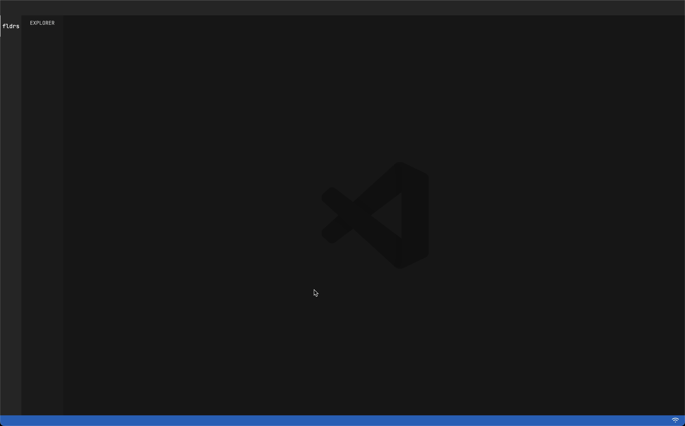
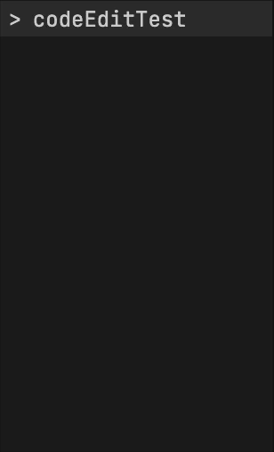
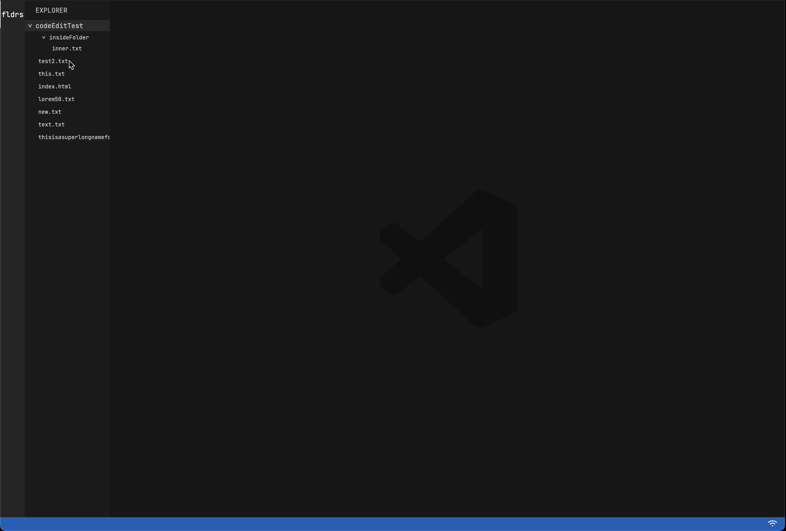
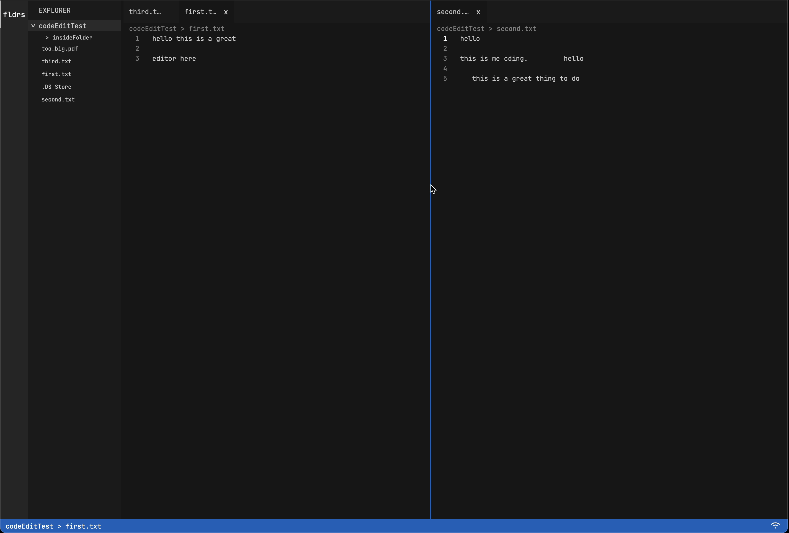

# Code Editor

## Table of demands for KAJ

| Kategorie                         | Popis                                                                                             | Povinné |   Body | Poznámka                     | Solution                                                                                                                                   |
|:----------------------------------|:--------------------------------------------------------------------------------------------------|:--------|-------:|:-----------------------------|:-------------------------------------------------------------------------------------------------------------------------------------------|
| Dokumentace                       | cíl projektu, postup, popis funkčnosti, komentáře ve zdrojovém kódu                               | X       |      1 |                              | HERE :-)                                                                                                                                   |
| HTML 5                            |                                                                                                   |         |     10 |                              |
| Validita                          | Validní použití HTML5 doctype                                                                     | X       |      1 | https://validator.w3.org     | Checked against online validator                                                                                                           |
| Validita                          | Fungující v moderních prohlíčečích v posledních vývojových verzích (Chrome, Firefox, Edge, Opera) |         |      2 | Platí pro vše, ne jenom HTML | In browsers that have FileSystemDirectoryHandle                                                                                            | 
| Semantické značky                 | správné použití sémantických značek  (section, article, nav, aside, ...)                          | X       |      1 |                              | I believe :-)                                                                                                                              |
| Grafika - SVG / Canvas            |                                                                                                   |         |      2 |                              | Code Editor Logo + Wifi Sign animation                                                                                                     |
| Média - Audio/Video               |                                                                                                   |         |      1 |                              | ---                                                                                                                                        |
| Formulářové prvky                 | Validace, typy, placeholder, autofocus                                                            |         |      2 |                              | ---                                                                                                                                        |
| Offline aplikace                  | využití možnosti fungování stránky bez Internetového připojení (viz sekce Javascript)             |         |      1 |                              | The app doesnt need wifi to function at this time.                                                                                         |
| CSS                               |                                                                                                   |         |      8 |                              |
| Pokročilé selektory               | použití pokročilých pseudotříd a kombinátorů                                                      | X       |      1 |                              | :hover, :not(), ::before, :nth-of-type(2), >                                                                                               |
| Vendor prefixy                    |                                                                                                   |         |      1 |                              | -webkit-scrollbar for scrollbar customisation                                                                                              |
| CSS3 transformace 2D/3D           |                                                                                                   |         |      2 |                              | transform rotations when left panel element pressed                                                                                        |
| CSS3 transitions/animations       |                                                                                                   | X       |      2 |                              | When animating wifi sign                                                                                                                   |
| Media queries                     | stránky fungují i na mobilních zařízeních i jiných (tedy nerozpadají se)                          |         |      2 |                              | I am not using many media queries because I leaned on the flexbox design and my page is responsive even without the need of media queries. |
| Javascript                        |                                                                                                   |         |     12 |                              |
| OOP přístup                       | prototypová dědičnost, její využití, jmenné prostory                                              | X       |      2 |                              | The project uses mainly classes and is modularised                                                                                         |
| Použití JS frameworku či knihovny | použití a pochopení frameworku či knihovny jQuery, React, Vue ..                                  |         |      1 |                              | ---                                                                                                                                        |
| Použití pokročilých JS API        | využití pokročilých API (File API, Geolocation, Drag & Drop, LocalStorage, Sockety, ...)          | X       |      3 |                              | FileAPI, Drag & Drop, Internet                                                                                                             |
| Funkční historie                  | posun tlačítky zpět/vpřed prohlížeče - pokud to vyplývá z funkcionatilty (History API)            |         |      2 |                              | ---                                                                                                                                        |
| Ovládání medií                    | použití Média API (video, zvuk), přehrávání z JS                                                  |         |      1 |                              | ---                                                                                                                                        |
| Offline aplikace                  | využití JS API pro zjišťování stavu                                                               |         |      1 |                              | I am detecting whether the app is connected to internet or not                                                                             |
| JS práce se SVG                   | události, tvorba, úpravy                                                                          |         |      2 |                              | The wifi sign is animated when wifi is lost and regained back                                                                              |
| Ostatní                           |                                                                                                   |         |      5 |                              |
| Kompletnost řešení                |                                                                                                   |         |      3 |                              |
| Estetické zpracování              |                                                                                                   |         |      2 |                              |
|                                  |                                                                                                   | Celkem  |     36 |                              |

## The Editor

This application is a coding editor inspired by VS Code. It consists of four main parts:

1. **Left navigation menu** with selected folders
2. **Left panel (Explorer)** displaying files
3. **Editor content section** with columns and rows
4. **Footer section**

---

### Left Navigation Menu

Currently, only folders can be selected, but more selection options can be added in the future.

---

### Left Panel (Explorer)

The Explorer is empty by default.
When files or folders are dragged and dropped into the application, the root folder appears in the Explorer.
Each folder can be opened by clicking on it to reveal its contents.
An animation of the collapse sign is shown (rotation 90deg) after clicking on the folder.

#### Folder

Represented by the `DirectoryFolder` class, a folder can contain zero or more directories
(either other folders or files).

After right-clicking on the Folder, a contextmenu will appear. You can:
1. Add new File.
2. Add new Folder.
3. Delete the folder with its contents.

#### File

Represented by the `DirectoryFile` class, a file contains text content.
When clicked, its contents are shown in a `EditorRow` within the Editor Content section. 
`WindowBar` also appears in respective editor row.

After right-clicking on File, it can be deleted.

> ⚠️ When the File is bigger than 1MB, it won't open and won't be red.

> ⚠️ Currently, only one `WindowBar` per file can be opened at a time. This may be expanded in the future.

---

### Editor Content Section

This section holds the files that are currently being edited. When empty, the editor logo is displayed.

> ⚠️ Logo SVG is from: https://upload.wikimedia.org/wikipedia/commons/9/9a/Visual_Studio_Code_1.35_icon.svg

#### Columns

The editor content is divided into columns that hold the main content. When there are no `Rows` in the Column, and it is 
not the first one it disappears. 

#### Rows

Each column contains zero or more rows, which can display `WindowBars` and text content.  
The text is edited in a contenteditable element.
Each row is its own element, and when selected, it brightens.
In each row, the path of the currently selected `WindowBar` is shown above the file content.

#### Window Bars

`WindowBars` represent opened files. They can be:
- **Selected**, in which case their content is displayed in a row.
- **Unselected**, sitting idle.
- **Dragged** between rows for rearrangement.
- **Split Right** after right-clicking the editor column can be split right.
- **Split Down** after right-clicking the editor row can be split down.

Splitting right and down:

> ⚠️ Only one `WindowBar` can display content in a row at a time.

---

### Footer Section

At the bottom of the page is a Footer Section with information for the user about Wi-Fi 
connection and file path of a currently edited file.

#### Global Path

The left side of the footer displays the full path of the currently opened and selected file
(the most recently selected one).
If no file is selected or open, the path is hidden.

#### Wi-Fi Indicator

While the application does not currently send or receive network data,
the API for detecting network status is implemented.

- A **white Wi-Fi icon** indicates that the system is connected.
- An **empty icon** means it is disconnected.
- Connecting or disconnecting triggers an animated transition on the Wi-Fi icon.

## Object Modelling

In this part, we are going to look at how the most complicated parts of the system are implemented.
I will be showing simplified-class diagrams of system modules.

### Directories

`Directory` is an abstract class for both file and folder.
`Folder` is a directory that has files and another folder in it.
`File` has content in it(text in our case).

### Handlers

`Handler` is an object that can be moved or moves with other elements on the page.
`UDHandler` moves on y-axis (Up and Down) and `LRHandler` moves on x-axis (Left and Right).
The `WindowBar` is also a handler.

The Context Menu is displayed when right-clicking on the `WindowBar`, `File` or `Folder`.
It displays a menu with options. 
When you click elsewhere, it disappears.
`ContextMenu` is the highest in the abstraction, then there are context menus for each element that can be right-clicked on.

